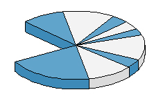



## A 3D Pie Chart Control

### Description

Design a 3D piechart for your custom app using an array of percentages. You can change the color scheme, and add mouseover , mousedown, and mouseup events for each pie piece in the chart
 
### More Info
 

             |
---                |---
**Submitted On**   |2003-10-28 20:08:26
**By**             |[Mark Anthony Entingh](https://github.com/Planet-Source-Code/PSCIndex/blob/master/ByAuthor/mark-anthony-entingh.md)
**Level**          |Advanced
**User Rating**    |4.9 (69 globes from 14 users)
**Compatibility**  |VB 3\.0, VB 4\.0 \(32\-bit\), VB 5\.0, VB 6\.0
**Category**       |[Custom Controls/ Forms/  Menus](https://github.com/Planet-Source-Code/PSCIndex/blob/master/ByCategory/custom-controls-forms-menus__1-4.md)
**World**          |[Visual Basic](https://github.com/Planet-Source-Code/PSCIndex/blob/master/ByWorld/visual-basic.md)
**Archive File**   |[A\_3D\_Pie\_C1710562182004\.zip](https://github.com/Planet-Source-Code/mark-anthony-entingh-a-3d-pie-chart-control__1-51853/archive/master.zip)

